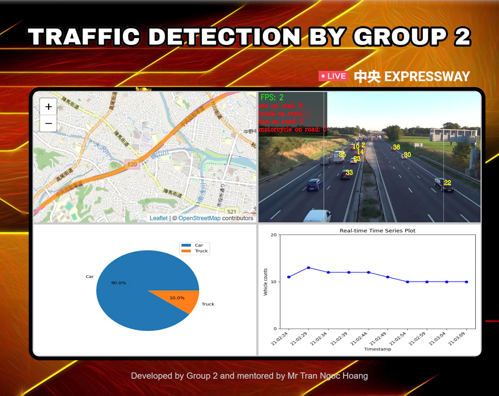

# DAP---Counting-Car-From-Camera-then-Project-It-on-Folium
This web application provides real-time vehicle counting on a road, displayed in 4 interactive frames. The application visualizes traffic conditions using a map, vehicle counts, pie charts, and time series data. The system updates every few seconds to provide accurate traffic insights.



## Features

- **Frame 1 - Map**: Displays a map of the road with a line representing the traffic. The line color changes every 2 seconds based on the number of vehicles detected, with the traffic density predicted by the `traffic_model`.
- **Frame 2 - Vehicle Counting**: Real-time vehicle counting occurs in this frame, providing data used by the traffic model for color predictions.
- **Frame 3 - Pie Chart**: Shows the ratio of different vehicle types on the road (bus, cars, motorcycles, trucks).
- **Frame 4 - Time Series Chart**: Displays the total number of vehicles counted over time, updating every 5 seconds.


## Installation

### Prerequisites

- Python 3.x


### Setup

1. Clone this repository:

   ```bash
   git clone https://github.com/yourusername/Traffic-Density-Webapp.git
2. Install the required dependencies:

    ```bash
    pip install -r requirements.txt
